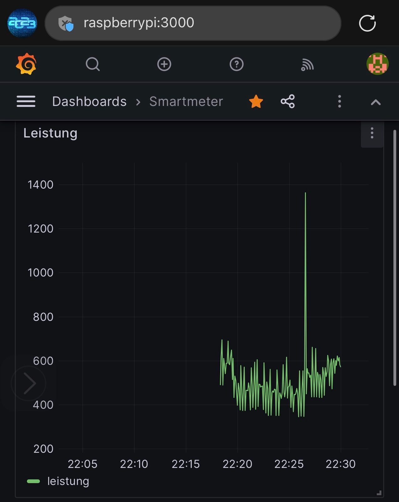
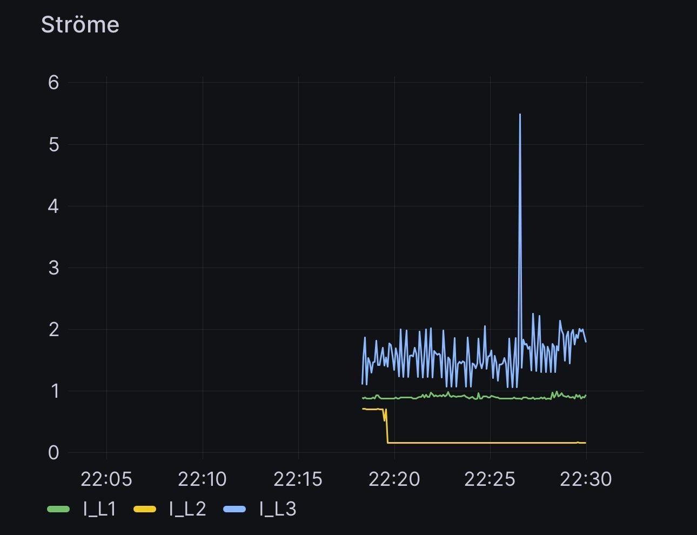
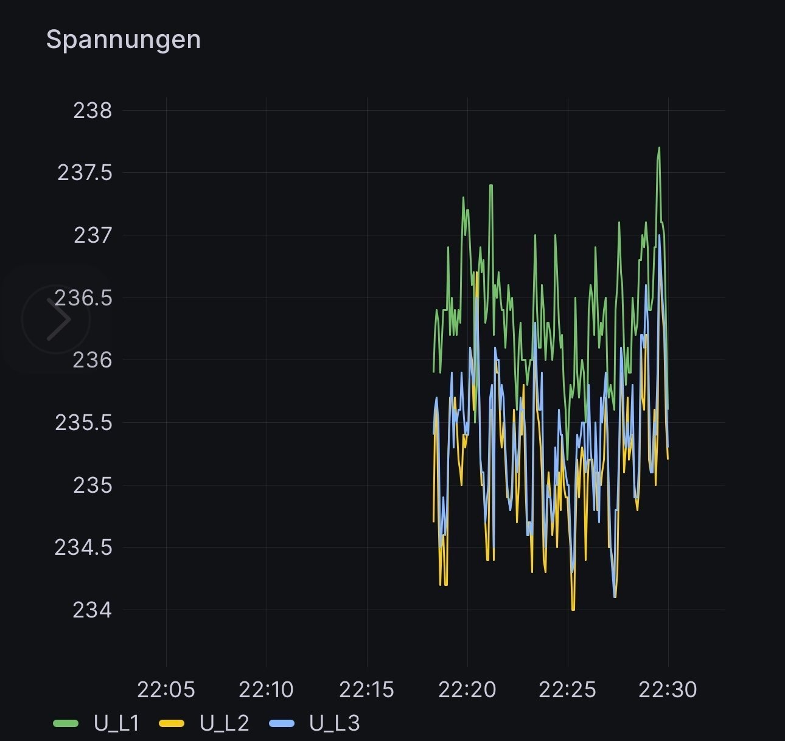

# :zap: Smartmeter Readout with RasPi :chart_with_upwards_trend:

This repository contains (hobby) code and HowTo's to perform SmartMeter readout of Kaifa MA309. Particularly, this smartmeter is used by EVN (Netz NÖ GmbH) and read via its customer interface (EVN Kundenschnittstelle) on a RasPi.

## Usage (EN)

Each measurement (every 3 seconds),

- a `html`-file is (over-)written such that the webserver yields the latest readout (indicated by a timestamp)
- a row is written to a MySQL Database

`git clone https://github.com/MatthiasMi/EVNKaifaMA309.git`
clones the repository
`cd EVNKaifaMA309`
to change into the folder and execute
`python3 EVNKaifaMA309/smartmeter.py`
or
`./EVNKaifaMA309/smartmeter.py`
if it has been made executable with
`chmod +x EVNKaifaMA309/smartmeter.py`

## HowTo

How to read the SmartMeter (Steps 2-3 until automatized)

1. Boot RasPi and connect cable to EVN Kaifa MA309
2. [Win] Use PuTTY to connect to RasPi via ssh
3. Start script `./EVNKaifaMA309/smartmeter.py`
4. View HTML in Browser `localhost`
5. View Grafana in Browser `localhost:3300`

## DE

Für jeden neuen Messwert (ca. alle 3 Sekunden) wird

- eine Zeile in die MySQL-Datenbank geschrieben,
- eine `html`-Datei (über)schrieben (Webserver liefert dann stets möglichst aktuelle Daten, siehe Zeitstempel)
  Die wichtigesten Konfigurationen sind
- `smartmeter.sql` MySQL Initalization
- `smartmeter.json` Dashboard für Grafana (Anpassungen nach Geschmack)

## Example

Sample view on smartmeter-readout database via Grafana:

_Figure 1. Smartmeter Readout: Power (Leistung) [W]_

_Figure 2. Smartmeter Readout: Current (Strom) [A]_

_Figure 3. Smartmeter Readout: Voltage (Spannung) [V]_

## Access

As a customer, get started by requesting the password [Kundenschnittstelle](<https://www.netz-noe.at/Download-(1)/Smart-Meter/218_9_SmartMeter_Kundenschnittstelle_lektoriert_14.aspx>) via `mailto:smartmeter@netz-noe.at` with "Kundennummer" / "Vertragskontonummer", and "Zählernummer".

## Software Requirements

`sudo apt install pip`
installs pip and all requirements
`pip install -r requirements.txt`
and to set them up system wide
`sudo pip --break-system-packages install -r requirements.txt`

### Webserver

Install a webserver via
`sudo apt install apache2`
and enable it
`systemctl status apache2`
before changing to the folder,
`cd /var/www/`
moving the default page
`sudo mv html/index.html html/default.html`
and making it writable for the script
`sudo chown pi html`

### Database

To add a database, first install
`sudo apt-get -y install mariadb-server mysql-server`
and after testing the connection
`mysql -hlocalhost -upi -pP4ssw0rd!!!11oneELEVEN db`
provision the database structure
`cat EVNKaifaMA309/smartmeter.sql | mysql -hlocalhost -upi -P4ssw0rd!!!11oneELEVEN db`
of the MySQL Initialization file `smartmeter.sql`.

Needless to say, passing these parameters and in particular the password via environment variables is the preferred way.

### Grafana

Install Grafana via
`wget -q -O - https://packages.grafana.com/gpg.key | sudo apt-key add -`
and
`echo "deb https://packages.grafana.com/oss/deb stable main" | sudo tee -a /etc/apt/sources.list.d/grafana.list`
then
`sudo apt-get update && sudo apt-get install -y grafana`
and enable
`sudo /bin/systemctl enable grafana-server`
the start it
`sudo /bin/systemctl start grafana-server`

As a suggestion, `smartmeter.json` is a Grafana-Dashboard showing the db's row values.

### Autostart

Re-parent forked process by `init` by setting
`setsid python3 EVNKaifaMA309/smartmeter.py < /dev/zero &> /dev/null &`
Autostart via `crontab` is done by executing
`sudo crontab -e`
then setting
`@reboot setsid python3 EVNKaifaMA309/smartmeter.py < /dev/zero &> /dev/null &`
or
`@reboot python3 ./EVNKaifaMA309/smartmeter.py &`
